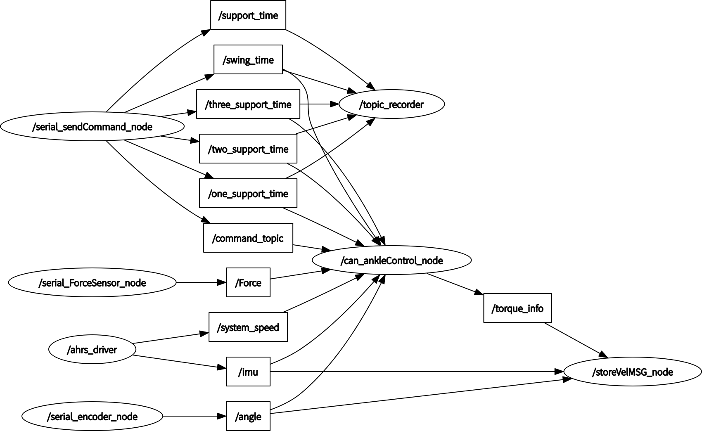

# Ankle Exoskeleton Control System

基于 ROS2 Humble 的脚踝外骨骼机器人控制系统，包含 CAN 总线电机控制与 FDILink AHRS 惯性导航传感器驱动。

## 项目结构

```
ankle_ws/
├── src/
│   ├── can_ankle/          # CAN 总线脚踝关节电机控制包
│   │   ├── include/        # 头文件 (controlcan.h, can_ankle_node.h)
│   │   ├── src/            # 源代码 (9个节点)
│   │   ├── launch/         # 启动文件 (Python)
│   │   ├── lib/            # 第三方 CAN 库 (libcontrolcan.so)
│   │   └── msg/            # 自定义 ROS 消息 (Torque.msg)
│   └── fdilink_ahrs/       # FDILink AHRS IMU 传感器驱动包 (5A A5协议)
│       ├── include/        # 头文件
│       ├── src/            # 源代码
│       └── launch/         # 启动文件 (Python)
├── data/                   # 实验数据
│   ├── lzfirst/            # 编码器/扭矩实验记录
│   └── *.bag, *.csv        # ROS 录包及数据文件
├── docs/                   # 文档
│   ├── note/               # 传感器协议 & 操作手册
│   └── ros通信架构.png      # ROS 通信架构图
├── build/                  # 编译输出 (colcon)
├── install/                # 安装目录 (colcon)
└── log/                    # 编译日志 (colcon)
```

## 软件包说明

### can_ankle — 脚踝电机 CAN 总线控制

| 节点名称 | 功能描述 |
|---------|---------|
| `can_ankleTorqueDriver_node` | 力矩模式电机驱动 |
| `can_ankleVelocity_node` | 速度模式电机驱动 |
| `can_ankleControl_node` | 电机综合控制（含 CANopen 配置、模式切换） |
| `can_test_node` | CAN 通信测试节点 |
| `serial_ForceSensor_node` | 力传感器 (Modbus RTU) |
| `serial_encoder_node` | 编码器 (Modbus RTU) |
| `serial_sendCommand_node` | 串口指令发送 |
| `storeTopicMSG_node` | ROS 话题数据记录 |
| `storeVelMSG_node` | 速度数据记录 |

**启动方式：**
```bash
ros2 launch can_ankle start_node.launch.py
```

### fdilink_ahrs — FDILink 惯性导航传感器驱动 (5A A5协议)

| 发布话题 | 消息类型 | 说明 |
|---------|---------|------|
| `/imu` | `sensor_msgs/Imu` | IMU 数据（四元数） |
| `/mag_pose_2d` | `geometry_msgs/Pose2D` | 地磁北二维朝向角 |
| `/euler_angles` | `geometry_msgs/Vector3` | 欧拉角 |
| `/magnetic` | `geometry_msgs/Vector3` | 磁力计 |
| `/gps/fix` | `sensor_msgs/NavSatFix` | GPS 定位 |
| `/system_speed` | `geometry_msgs/Twist` | 机体系速度 |
| `/NED_odometry` | `nav_msgs/Odometry` | NED 系位移与速度 |

**启动方式：**
```bash
ros2 launch fdilink_ahrs ahrs_data.launch.py
ros2 launch fdilink_ahrs tf.launch.py
```

## 环境要求

| 依赖 | 说明 |
|------|------|
| Ubuntu 22.04 | 操作系统 |
| ROS2 Humble | 机器人操作系统 |
| Eigen3 | 线性代数库 |
| wjwwood/serial | 串口通信库 |

**安装系统依赖：**
```bash
sudo apt install libeigen3-dev
# wjwwood/serial 需从源码安装: https://github.com/wjwwood/serial
```

## 编译

```bash
cd ankle_ws
source /opt/ros/humble/setup.bash
colcon build --symlink-install
source install/setup.bash
```

## ROS 通信架构

项目包含传感器采集、CAN 总线电机控制、数据记录三个环节的 ROS 节点通信拓扑。



## 实验数据

`data/` 目录下的 `.bag` 文件为 ROS 实验数据录包，包含不同控制参数下的脚踝外骨骼运行数据。
